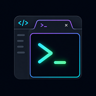

# Chrominal

Open new terminals instantly from the editor title bar — each one with a unique random color and icon.

## Features

Two buttons are always visible in the editor title bar:

- **Terminal (Panel)** — opens a new terminal in the bottom panel
- **Terminal (Editor Tab)** — opens a new terminal as a full editor tab

Every terminal gets a distinct color and icon automatically picked to avoid duplicates with already open terminals. Colors are chosen from a curated palette of 6 vivid ANSI colors (red, green, yellow, blue, magenta, cyan) — white and black are excluded for better visibility.

## Usage

Click the terminal icons in the top-right area of the editor:

| Button | Action |
|--------|--------|
| `$(terminal)` | Open terminal in bottom panel |
| `$(terminal-tmux)` | Open terminal in editor tab |

No configuration needed — works out of the box.

## Requirements

VS Code `1.60.0` or higher.
